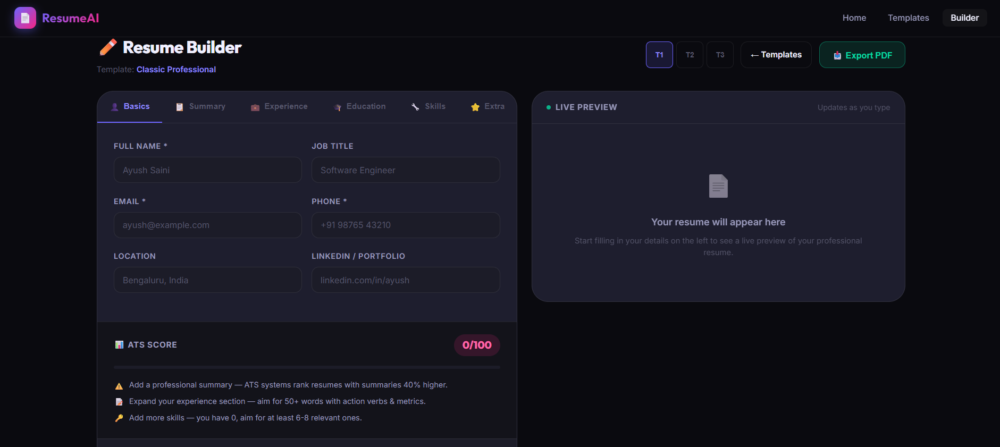
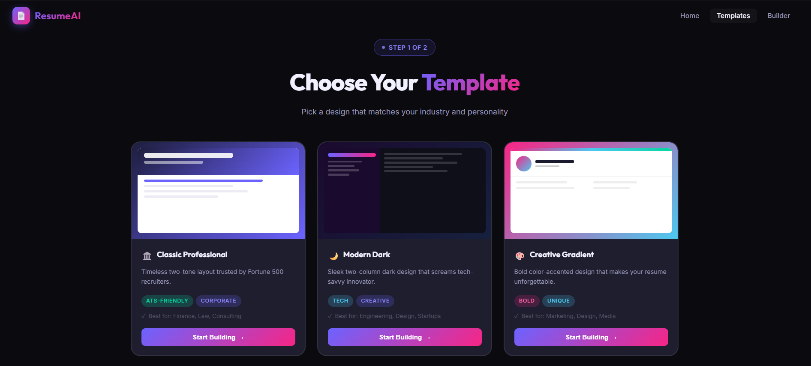
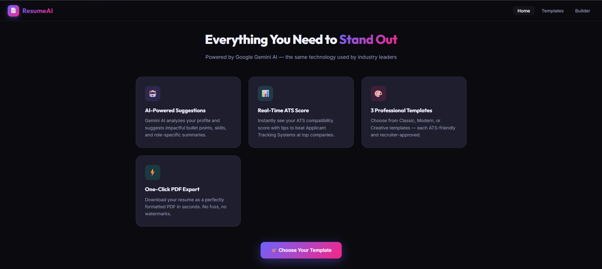

<div align="center">
  
  # 🚀 ResumeAI
  ### Build a Resume That Gets You Hired.
  
  **An AI-Powered Full-Stack Resume Builder built with the MERN Stack & Google Gemini.**
  
  [](https://reactjs.org/)
  [](https://nodejs.org/)
  [](https://www.mongodb.com/)
  [](https://vercel.com/)
  [](https://ai.google.dev/)
  
</div>

---

## ✨ Features

ResumeAI goes beyond standard templates by seamlessly integrating Artificial Intelligence to actively help you write a better resume.

*   🤖 **AI-Powered Suggestions**: Powered by Google Gemini. Instantly generate professional summaries and discover high-value technical skills tailored to your experience.
*   ⚡ **AI Experience Enhancer**: Automatically rewrite your bullet points using industry-standard action verbs and impact metrics.
*   📊 **Real-Time ATS Score**: See your Application Tracking System compatibility score update dynamically as you type, complete with actionable tips.
*   🎨 **Premium Modern Designs**: Choose from 3 premium, recruiter-approved templates (Classic, Modern Dark, Creative) with live side-by-side rendering.
*   📥 **One-Click PDF Export**: Download your finished resume instantly in a perfectly formatted PDF without watermarks.

---

## 📸 Screenshots

*(Add the images you shared to an `assets` folder in your repo to display them here!)*

| Landing Page | Live Builder |
| :---: | :---: |
|  |  |
| **Template Gallery** | **Features & Tech** |
|  |  |

---

## 🛠️ Project Architecture

```
Resume-builder/
├── frontend/                 # React Application
│   ├── public/               
│   ├── src/                  
│   │   ├── pages/            # View components (Home, Builder, Gallery)
│   │   ├── services/         # API integrations (aiService, resumeService)
│   │   ├── App.css           # Premium glassmorphism design tokens
│   │   └── App.js            # Main React Router
│   └── package.json          
│
├── backend/                  # Express/Node API Server
│   ├── models/               # MongoDB Schemas (resume.js)
│   ├── routes/               # API Endpoints (ai.js, resume.js)
│   ├── .env                  # Secrets configuration
│   └── server.js             # Entry Point & Vercel serverless export
│
└── vercel.json               # Fullstack deployment configuration
```

---

## 🚀 Local Setup & Installation

Follow these steps to run both the frontend and backend simultaneously on your local machine.

### Prerequisites
*   [Node.js](https://nodejs.org/) installed
*   [MongoDB](https://www.mongodb.com/) (Local or Atlas URL)
*   [Google Gemini API Key](https://aistudio.google.com/app/apikey) (Optional, but required for AI features)

### 1. Clone the repository
```bash
git clone https://github.com/AYUSHSAINI9876/Resume-builder.git
cd Resume-builder
```

### 2. Run the Backend API
1. Navigate to the backend directory:
   ```bash
   cd backend
   ```
2. Install dependencies:
   ```bash
   npm install
   ```
3. Configure Environment Variables. Create a `.env` file inside `/backend` and add:
   ```env
   PORT=5000
   MONGO_URI=mongodb://localhost:27017/resumeBuilder
   GEMINI_API_KEY=your_google_gemini_api_key_here
   ```
4. Start the server (runs on `http://localhost:5000`):
   ```bash
   npm run dev
   ```

### 3. Run the Frontend React App
1. Open a new terminal and navigate to the frontend directory:
   ```bash
   cd frontend
   ```
2. Install dependencies:
   ```bash
   npm install
   ```
3. Start the React development server (runs on `http://localhost:3000`):
   ```bash
   npm start
   ```

*(Your browser will automatically open to port 3000 where you can interact with ResumeAI).*

---

## 🌐 Deploying to Vercel (Fullstack)

This repository is pre-configured with a `vercel.json` file for an effortless monorepo deployment!

1. Commit and push all your code to GitHub.
2. Go to the [Vercel Dashboard](https://vercel.com/dashboard) and click **Add New > Project**.
3. Import your `Resume-builder` GitHub repository.
4. Expand the **Environment Variables** section and add:
   *   `MONGO_URI` (Must be a MongoDB Atlas cloud URL)
   *   `GEMINI_API_KEY`
5. Click **Deploy**. Vercel will automatically build the React frontend and configure the Express backend as serverless functions targeting `/api/*`.

---

<div align="center">
  <i>Developed with ❤️ by Ayush Saini</i>
</div>