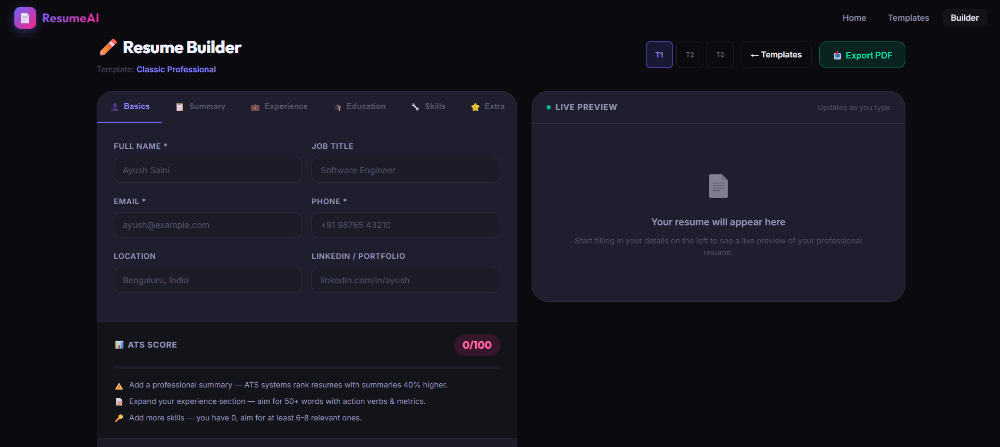
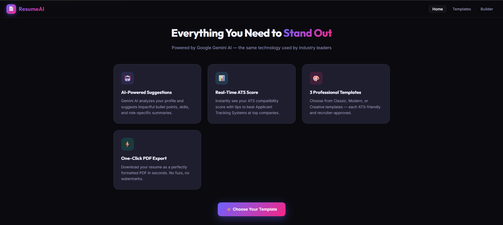
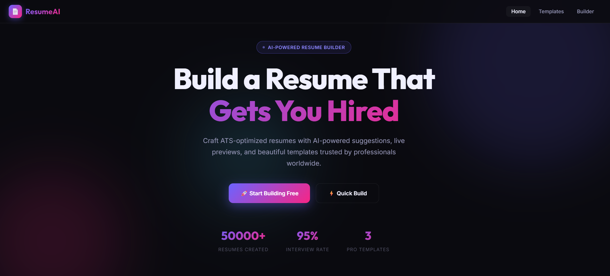
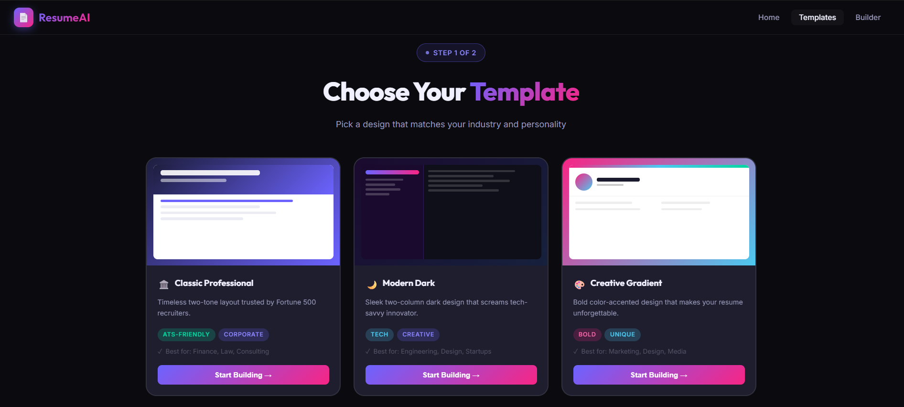

<div align="center">

# 🚀 ResumeAI: The Voice-Controlled Resume Builder

### Build a Professional Resume with just your Voice & Google Gemini.

**An AI-Powered Full-Stack Resume Builder built with the MERN Stack, Speech Recognition, and Google Gemini.**

[](https://reactjs.org/)
[](https://nodejs.org/)
[](https://www.mongodb.com/)
[](https://vercel.com/)
[](https://ai.google.dev/)

[Live Demo](https://resume-builder-alpha-ten.vercel.app/) • [Report Bug](https://github.com/AYUSHSAINI9876/Resume-builder/issues) • [Request Feature](https://github.com/AYUSHSAINI9876/Resume-builder/issues)

</div>

---

## ✨ Features

ResumeAI goes beyond standard templates by seamlessly integrating **Voice Control** and **Artificial Intelligence** to help you build a recruiter-approved resume faster than ever.

### 🎙️ Revolutionary Voice Control
*   **Global Voice AI**: Speak your entire career story in one go. Our AI parses your speech and automatically populates every section of your resume.
*   **Section Dictation**: Want to focus on just your experience? Use the "Dictate" button on any field to add content hands-free.
*   **Smart Voice Validation**: Automatically formats dictated emails, phone numbers, and LinkedIn URLs. It even cleans up punctuation and formatting on the fly!
*   **Visual Feedback**: Interactive pulsing mic animations provide real-time feedback during voice sessions.

### 🤖 Google Gemini AI Integration
*   **AI Summary Generator**: Instantly generate professional summaries tailored to your target role and experience.
*   **Experience Enhancer**: Transform basic bullet points into high-impact, results-driven statements using industry action verbs.
*   **AI Skill Suggester**: Analyzes your experience to suggest the most relevant technical and soft skills.
*   **Deep Resume Review**: Get a comprehensive analysis of your resume with an ATS score, flaw detection, and one-click fixes.

### 🎨 Design & Export
*   **Real-Time ATS Score**: See your compatibility score update dynamically as you type, with actionable tips for improvement.
*   **Premium Modern Templates**: Choose from 3 recruiter-approved designs (Classic Professional, Modern Dark, Creative Gradient) with live side-by-side rendering.
*   **One-Click PDF Export**: Download a perfectly formatted, professional PDF instantly without any watermarks.

---

## 📸 Visual Tour

| **Modern Builder Interface** | **Live AI Enhancements** |
| :---: | :---: |
|  |  |
| **Landing Page** | **Template Gallery** |
|  |  |

---

## 🛠️ Project Architecture

```
Resume-builder/
├── frontend/                 # React Application
│   ├── src/                  
│   │   ├── pages/            # View components (Home, Builder, Gallery)
│   │   ├── services/         # API integrations (aiService, resumeService)
│   │   ├── App.css           # Premium glassmorphism design tokens
│   │   └── App.js            # Main React Router
│
├── backend/                  # Express/Node API Server
│   ├── models/               # MongoDB Schemas (resume.js)
│   ├── routes/               # API Endpoints (ai.js, resume.js)
│   ├── .env                  # Secrets configuration
│   └── server.js             # Entry Point & Vercel serverless export
│
└── vercel.json               # Fullstack deployment configuration
```

---

## 🚀 Getting Started

### Prerequisites
*   [Node.js](https://nodejs.org/) (v14+)
*   [MongoDB](https://www.mongodb.com/) (Local or Atlas URL)
*   [Google Gemini API Key](https://aistudio.google.com/app/apikey)

### Installation & Local Setup

1. **Clone the repository**
   ```bash
   git clone https://github.com/AYUSHSAINI9876/Resume-builder.git
   cd Resume-builder
   ```

2. **Setup Backend API**
   - Navigate to `backend`: `cd backend`
   - Install dependencies: `npm install`
   - Create a `.env` file:
     ```env
     PORT=5000
     MONGO_URI=your_mongodb_uri
     GEMINI_API_KEY=your_gemini_api_key
     ```
   - Start server: `npm run dev`

3. **Setup Frontend React App**
   - Navigate to `frontend`: `cd ../frontend`
   - Install dependencies: `npm install`
   - Start development server: `npm start`

---

## 🎙️ Voice Command Guide

To get the most out of **ResumeAI**, try these voice commands:

*   **Global Mode**: Click "Global Voice AI" and say: *"My name is Ayush Saini, I am a Full Stack Developer. I have 2 years of experience in React and Node.js. I graduated from... My email is..."*
*   **Experience Mode**: Click "Dictate" in the Experience tab and describe your role: *"I led a team of 5 to develop a voice-controlled resume builder which increased user engagement by 40%."*
*   **Validation**: When dictating email, just say *"ayush at gmail dot com"* and ResumeAI will format it as `ayush@gmail.com`.

---

## 🌐 Deployment (Fullstack)

This repository is pre-configured for an effortless **Vercel** deployment!
1. Commit and push all your code to GitHub.
2. Connect your repository to Vercel.
3. Add `MONGO_URI` and `GEMINI_API_KEY` to the **Environment Variables** section.
4. Click **Deploy**. Vercel will automatically configure the Express backend as serverless functions targeting `/api/*`.

---

<div align="center">
  <h3>Developed with ❤️ by <a href="https://github.com/AYUSHSAINI9876">Ayush Saini</a></h3>
  <p>If you like this project, please give it a ⭐ on GitHub!</p>
</div>